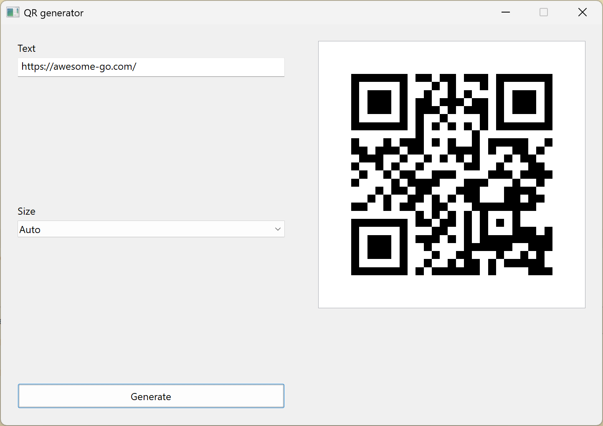

## Vye - QR code generator




## Installation

Download window exe file from [Github Release](https://github.com/ppvan/vye/releases)

## Build from source

On a window machine with go compiler installed:

```sh
cd vye/
go build -trimpath -ldflags "-s -w -H=windowsgui" -o vye.exe
```
